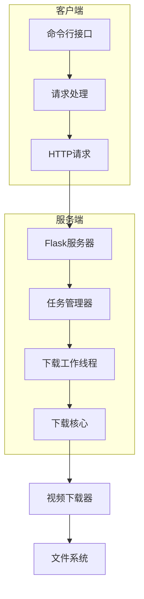
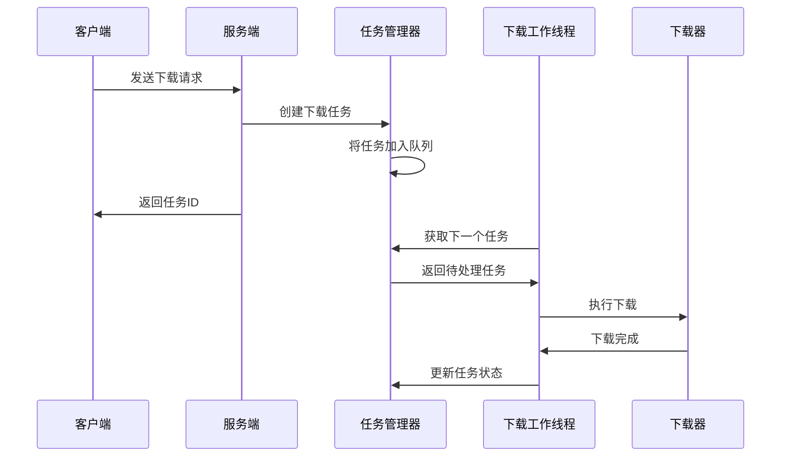
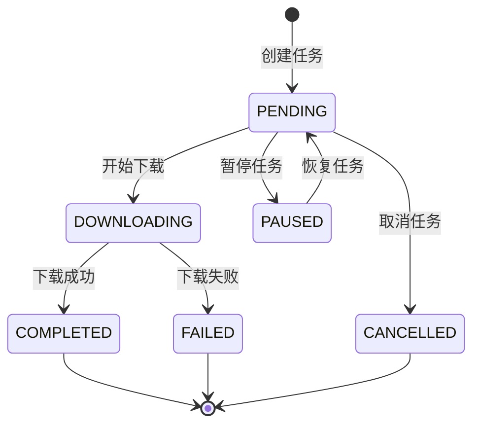

# bilidownloader-cmd

一个基于Python开发的B站视频下载工具，支持命令行操作，采用客户端-服务器架构设计。

# 目前登陆下载功能仍在施工中！！！需要登录才能看到的画质目前还无法下载！！！

## 功能特性

- 支持B站视频链接、AV号、BV号多种输入方式
- 支持自定义视频质量、音频质量和视频编码
- 支持仅下载音频模式
- 多任务并发下载
- 任务状态管理（暂停/恢复/取消）
- 下载进度实时显示
- 支持自定义下载目录和缓存目录
- 支持多线程下载加速

## 环境要求

- Python 3.6+
- FFmpeg（用于视频混流）

## 安装步骤

1. 克隆项目代码
2. 安装依赖包
3. 确保FFmpeg已安装并添加到系统环境变量

## 使用方法

### 启动服务器

```bash
python server.py [--host HOST] [--port PORT]
```

参数说明：
- `--host`: 服务器监听地址，默认为0.0.0.0
- `--port`: 服务器监听端口，默认为5000

### 客户端命令

1. 下载视频
```bash
python client.py download --input <视频链接/AV号/BV号> [选项]
```

可选参数：
- `--video-quality`: 视频质量（360P/480P/720P/1080P等），默认360P
- `--audio-quality`: 音频质量（64K/132K/192K等），默认192K
- `--codec`: 视频编码（H264/H265/AV1），默认H264
- `--download-dir`: 下载目录，默认为当前目录
- `--cache-dir`: 缓存目录，默认为当前目录
- `--audio-only`: 是否仅下载音频，默认False
- `--server-url`: 服务器地址，默认为http://localhost:5000
- `--threads`: 下载线程数，默认4

2. 查看任务列表
```bash
python client.py list [--server-url SERVER_URL]
```

3. 查看任务状态
```bash
python client.py status <task_id> [--server-url SERVER_URL]
```

4. 暂停任务
```bash
python client.py pause <task_id> [--server-url SERVER_URL]
```

5. 恢复任务
```bash
python client.py resume <task_id> [--server-url SERVER_URL]
```

6. 取消任务
```bash
python client.py cancel <task_id> [--server-url SERVER_URL]
```

## 工作流程

### 整体架构



### 下载流程



### 任务状态流转



## 注意事项

1. 使用前请确保FFmpeg已正确安装
2. 下载前需要先启动服务器
3. 支持的视频质量和编码格式取决于原视频
4. 如果设置的清晰度超过原视频，将自动使用最佳画质下载

## 配置文件

### 配置文件结构

配置文件使用YAML格式，默认文件名为`config.yaml`。配置文件包含服务器配置和客户端配置两个主要部分：

```yaml
server:
  host: 0.0.0.0    # 服务器监听地址
  port: 5000       # 服务器监听端口

client:
  server_url: http://localhost:5000  # 服务器地址
  video_quality: 360P                 # 视频质量
  audio_quality: 192K                 # 音频质量
  codec: H264                        # 视频编码
  download_dir: .                    # 下载目录
  cache_dir: .                       # 缓存目录
  audio_only: false                  # 是否仅下载音频
  threads: 4                         # 下载线程数
```

### 配置项说明

#### 服务器配置
- `host`: 服务器监听地址，默认为0.0.0.0（监听所有网络接口）
- `port`: 服务器监听端口，默认为5000

#### 客户端配置
- `server_url`: 服务器地址，默认为http://localhost:5000
- `video_quality`: 视频质量，可选值：360P/480P/720P/1080P/1080P_PLUS/1080P_60/4K/HDR/DOLBY/8K
- `audio_quality`: 音频质量，可选值：64K/132K/192K/HIRES/DOLBY
- `codec`: 视频编码，可选值：H264/H265/AV1
- `download_dir`: 下载目录，默认为当前目录
- `cache_dir`: 缓存目录，默认为当前目录
- `audio_only`: 是否仅下载音频，默认为false
- `threads`: 下载线程数，默认为4

### 使用说明

1. 首次运行程序时，会在当前目录自动创建默认配置文件`config.yaml`
2. 您可以根据需要修改配置文件中的各项参数
3. 命令行参数的优先级高于配置文件，即通过命令行指定的参数会覆盖配置文件中的对应设置

### 示例配置

以下是一个自定义配置示例：

```yaml
server:
  host: 127.0.0.1      # 仅监听本地连接
  port: 8080           # 使用8080端口

client:
  server_url: http://127.0.0.1:8080
  video_quality: 1080P  # 使用1080P视频质量
  audio_quality: HIRES  # 使用Hi-Res音质
  codec: H265          # 使用H265编码
  download_dir: D:/Videos/bilibili  # 自定义下载目录
  cache_dir: D:/Temp/bilibili      # 自定义缓存目录
  audio_only: false
  threads: 8           # 使用8线程下载```